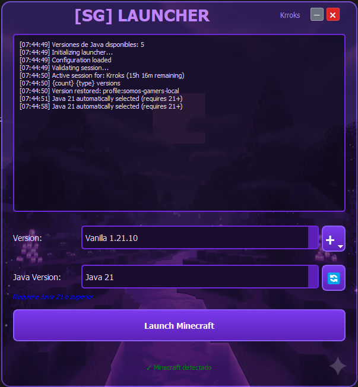

# Minecraft Java Edition Launcher

A custom launcher for Minecraft Java Edition that maintains user credentials for connecting to online servers.



## Features

- ✅ Microsoft/Mojang authentication
- ✅ Secure credential storage (local encryption)
- ✅ Maintains active session for online servers
- ✅ Intuitive graphical interface with PyQt5
- ✅ Automatic detection of Minecraft installation
- ✅ Saves credentials for future use
- ✅ Full support for NeoForge, Forge, Fabric, and Vanilla versions
- ✅ Automatic Java runtime detection and download
- ✅ Proper handling of version inheritance and library management
- ✅ **Download new Minecraft versions** directly from Mojang's manifest
- ✅ **Automatic library downloading** when installing new versions
- ✅ **Hierarchical version organization** (Vanilla, Custom, Snapshot)
- ✅ **Dynamic background images** based on version type
- ✅ **User menu** with avatar and session management
- ✅ **Background version loading** for faster startup
- ✅ **Custom Game Profiles** - Install custom NeoForge/Forge/Vanilla profiles with mods, shaders, and resource packs
- ✅ **Automatic asset downloading** - Downloads and verifies Minecraft assets from Mojang servers
- ✅ **Server Manager** (Developer Mode) - Manage remote server profiles and configurations
- ✅ **Isolated profile directories** - Each custom profile has its own mods, shaders, resource packs, and config
- ✅ **Automatic server addition** - Custom profiles automatically add server to Minecraft Multiplayer list
- ✅ **Profile update checking** - Automatically checks for updates (mods, shaders, resource packs) when launching custom profiles
- ✅ **Improved application loading** - UI appears immediately, data loads progressively in background
- ✅ **Purple-themed UI** - Consistent purple color scheme throughout the interface
- ✅ **NeoForge version installation** - Install NeoForge versions directly from Maven repository
- ✅ **Asset download notifications** - Real-time messages when downloading Minecraft assets
- ✅ **Auto-scrolling message area** - Message area automatically scrolls to show latest messages

## Requirements

- **Python 3.8 or higher**
- **Minecraft Java Edition** installed (uses standard `.minecraft` directory)
- **Java Runtime Environment (JRE)** - The launcher can automatically download the required version
- **Internet connection** for authentication and downloading game files

## Installation

### 1. Clone or download this repository

```bash
git clone https://github.com/dcapape/minecraft-launcher.git
cd minecraft-launcher
```

### 2. Create a virtual environment (recommended)

```bash
# On Windows
python3 -m venv .venv
.venv\Scripts\activate

# On Linux/macOS
python3 -m venv .venv
source .venv/bin/activate
```

**Note**: If `python` points to Python 2.7 on your system, use `python3` instead.

### 3. Install dependencies 

```bash
# Make sure you're using Python 3
python3 -m pip install -r requirements.txt
```

### 4. Verify installation

Make sure all required packages are installed:
- `requests` - For HTTP requests
- `cryptography` - For credential encryption
- `PyQt5` - For the graphical interface
- `PyQtWebEngine` - For OAuth authentication flow

## Usage

### Running the Launcher

1. **Start the launcher:**  
```bash
# On Windows/Linux/macOS - use python3 if python points to Python 2.7
python3 launcher.py

# Or if python already points to Python 3:
python launcher.py
```

2. **Authenticate:**
   - Click "Sign In" to authenticate with your Microsoft account
   - Follow the on-screen instructions to complete the OAuth flow
   - The launcher will open a browser window for Microsoft authentication

3. **Select or Download Minecraft Version:**
   - Select a Minecraft version from the dropdown (organized as Vanilla, Custom, Snapshot)
   - Click the "+" button to download new versions from Mojang's manifest
   - The launcher will automatically download the version JSON, client JAR, and all required libraries
   - Downloads continue in the background even after closing the download dialog

4. **Custom Profiles (Optional):**
   - Click the "+" button and select "Custom" to add a remote profile
   - Enter the server hostname/IP to fetch profile configuration
   - The launcher will automatically:
     - Download and install the base Minecraft/NeoForge version
     - Download all specified mods, shaders, and resource packs
     - Configure the profile's `options.txt` file
     - Download all required assets from Mojang servers
     - Add the server to Minecraft's Multiplayer list
   - Custom profiles are stored in `.minecraft/profiles/{profile_id}/` with complete isolation
   - When launching a custom profile, the launcher automatically checks for updates from the server

5. **Launch Minecraft:**
   - Click "Launch Minecraft" to start the game
   - If not authenticated, the launcher will prompt you to sign in
   - The launcher will automatically:
     - Detect or download the required Java version
     - Verify and download missing assets from Mojang servers
     - Build the correct classpath and module path
     - Extract native libraries to a temporary directory
     - Launch the game with proper credentials

### Command Line Usage

You can also launch Minecraft directly from the command line:

```bash
# Use python3 if python points to Python 2.7
python3 launcher.py
```

The launcher will use saved credentials if available, or prompt for authentication.

## Building an Executable

You can create a standalone executable using PyInstaller. This allows you to distribute the launcher without requiring Python to be installed.

### Prerequisites

Make sure PyInstaller is installed:

```bash
python3 -m pip install pyinstaller
```

### Building on Windows

1. **Using the batch script (recommended):**
   ```bash
   build_exe.bat
   ```

2. **Or manually:**
   ```bash
   python3 -m PyInstaller launcher.spec
   ```

The executable will be created in the `dist/` folder as `MinecraftLauncher.exe`.

### Building on Linux/macOS

1. **Using the shell script:**
   ```bash
   chmod +x build_exe.sh
   ./build_exe.sh
   ```

2. **Or manually:**
   ```bash
   python3 -m PyInstaller launcher.spec
   ```

The executable will be created in the `dist/` folder as `MinecraftLauncher`.

### Customizing the Build

You can modify `launcher.spec` to customize the build:
- Add an icon: Set `icon='icon.ico'` in the `EXE` section
- Include additional data files: Add them to the `datas` list
- Add hidden imports: Add them to the `hiddenimports` list

### Notes

- The first build may take several minutes as PyInstaller analyzes all dependencies
- The executable will be quite large (~100-200 MB) as it includes Python, PyQt5, and all dependencies
- The executable is standalone and doesn't require Python or any dependencies to run
- On Windows, the executable will be windowed (no console) as specified by `--windowed`

## How It Works

### Authentication Flow

The launcher uses Microsoft OAuth 2.0 flow for authentication:

1. **Microsoft Authentication** - User signs in with Microsoft account
2. **Xbox Live Authentication** - Account is verified with Xbox Live
3. **Minecraft Services Authentication** - Access token is obtained from Minecraft Services
4. **Profile Retrieval** - Minecraft profile and UUID are retrieved

### Credential Storage

- Credentials are stored encrypted using Fernet (symmetric encryption)
- Stored in `credentials.json` (encrypted)
- Encryption key stored in `key.key`
- Both files are in `.gitignore` for security

### Minecraft Launch Process

1. **Version Detection** - Automatically detects installed Minecraft versions
2. **Asset Verification** - Verifies and downloads missing assets from Mojang servers
3. **Version Inheritance** - Properly merges parent and child version JSONs
4. **Library Management** - Resolves all required libraries from merged JSON
5. **Classpath Construction** - Builds complete classpath with all libraries + version JAR
6. **Module Path Construction** - Builds module path with only explicitly listed JARs
7. **Native Extraction** - Extracts native libraries to unique temporary directory (`bin/<HASH>`)
8. **JVM Arguments** - Constructs proper JVM arguments respecting order and conditional rules
9. **Launch** - Executes Java with all required arguments

### Custom Profile Installation Process

1. **Profile Configuration** - Fetches profile JSON from remote server (`/profiles.json`)
2. **Base Version Installation** - Downloads and installs vanilla Minecraft version into profile directory
3. **NeoForge Installation** (if applicable) - Runs NeoForge installer targeting the profile directory
4. **Library Download** - Downloads all required libraries (including inherited ones) to profile's `libraries/` folder
5. **Asset Download** - Downloads all required assets to global `.minecraft/assets/` directory
6. **Mods/Shaders/Resource Packs** - Downloads all specified mods, shaders, and resource packs to profile directories
7. **Configuration** - Creates `launcher_profiles.json` and configures `options.txt` with profile settings

### Key Features

- **Duplicate Prevention**: Automatically removes duplicate JARs from classpath and module path
- **Native Library Handling**: Extracts only required native libraries for the current architecture
- **Version Inheritance**: Properly handles version inheritance chains (e.g., NeoForge → Vanilla)
- **Flag Filtering**: Omits flags without values (e.g., `--width`, `--height` when empty)

## Project Structure

```
launcher/
├── launcher.py              # Main GUI application
├── minecraft_launcher.py    # Core Minecraft launching logic
├── auth_manager.py          # Microsoft authentication manager
├── credential_storage.py    # Encrypted credential storage
├── java_downloader.py       # Java runtime downloader
├── asset_downloader.py     # Minecraft assets downloader and verifier
├── server_manager.py        # Server profile manager (developer mode)
├── config.py               # Configuration management
├── requirements.txt         # Python dependencies
├── launcher_config.json     # Launcher configuration
└── README.md               # This file
```

## Troubleshooting

### "Minecraft not detected"

- Ensure Minecraft Java Edition is installed
- The launcher searches in standard paths:
  - **Windows**: `%APPDATA%\.minecraft`
  - **Linux**: `~/.minecraft`
  - **macOS**: `~/Library/Application Support/minecraft`

### "Java not found"

- The launcher can automatically download the required Java version
- If manual installation is needed:
  - Install Java Runtime Environment (JRE) 8 or higher
  - Ensure Java is in your system PATH
  - Or specify Java path in the launcher settings

### Authentication errors

- Verify your internet connection
- Ensure you have a Microsoft account linked to Minecraft
- Try signing out and signing in again
- Clear browser cookies if OAuth flow fails

### "Invalid package name" error (NeoForge)

- This error is typically caused by duplicate JARs or incorrect native library handling
- The launcher now automatically:
  - Removes duplicate JARs from classpath and module path
  - Extracts natives to unique temporary directories
  - Uses proper JVM arguments pointing to the correct native directory

### Game fails to launch

- Check the error log in `.minecraft/logs/launcher_stderr_*.log`
- Verify all required libraries are downloaded
- Ensure the version JSON is valid and complete
- Check that Java version matches the required version
- For custom profiles, verify that all assets are downloaded (check `.minecraft/assets/`)

### Custom profile installation fails

- Verify the server URL is accessible and returns valid JSON at `/profiles.json`
- Check that the profile JSON has all required fields (version_base, mods, etc.)
- Ensure you have sufficient disk space for the profile installation
- Check network connectivity for downloading mods, shaders, and resource packs
- Verify that the base Minecraft version exists in the manifest

## Security Notes

- ⚠️ **Never share** `credentials.json` or `key.key` files
- ⚠️ These files are automatically excluded from git (`.gitignore`)
- ⚠️ If sharing your computer, use "Sign Out" before closing
- ⚠️ Credentials are encrypted locally but still sensitive

## Technical Details

### Version Inheritance

The launcher properly handles version inheritance by:
- Recursively loading parent versions
- Merging libraries, arguments, and other sections
- Child versions override parent values when conflicts occur
- Maintaining proper order (parent first, then child)

### Classpath vs Module Path

- **Classpath (`-cp`)**: Contains ALL libraries + version JAR (for compatibility)
- **Module Path (`-p`)**: Contains only JARs explicitly listed for Java module system
- Both are passed simultaneously (as the official launcher does)

### Native Library Extraction

- Natives are extracted from `*-natives-<platform>.jar` files
- Extracted to unique temporary directory: `.minecraft/bin/<HASH>/`
- Only architecture-specific files are extracted (e.g., `windows/x64/`)
- Files are placed directly in the root of the hash directory (no nested structure)

## New Features in v1.1.2

- **NeoForge Version Installation**:
  - Install NeoForge versions directly from the Maven repository
  - Browse and select from all available NeoForge versions
  - Shows Minecraft version compatibility for each NeoForge version
  - Automatically installs required vanilla Minecraft version if missing
  - Downloads and installs all necessary libraries automatically
- **Asset Download Notifications**:
  - Real-time messages in the launcher window when downloading Minecraft assets
  - Shows progress information during asset downloads
  - Better visibility into what the launcher is doing
- **Auto-scrolling Message Area**:
  - Message area automatically scrolls to show the latest messages
  - No need to manually scroll to see new updates

## New Features in v1.1.1

- **Automatic Server Addition**: 
  - Custom profiles automatically add the server to Minecraft's Multiplayer list (`servers.dat`)
  - Server information is added/updated every time a custom profile is launched
  - Supports `auto_connect` option to automatically connect to the server on launch
- **Profile Update Checking**:
  - Automatically checks for updates (mods, shaders, resource packs, options) when launching custom profiles
  - Downloads new or updated files from the server
  - Updates `options.txt` if server configuration has changed
- **Improved Application Loading**:
  - UI appears immediately when the launcher starts
  - Data loads progressively in the background (configuration, credentials, versions)
  - User sees progress messages in real-time
  - Much faster perceived startup time

## New Features in v1.1.0

- **Custom Game Profiles System**: 
  - Install custom NeoForge/Forge/Vanilla profiles from remote servers
  - Each profile is completely isolated with its own mods, shaders, resource packs, and config
  - Profiles are stored in `.minecraft/profiles/{profile_id}/` with full directory structure
  - Automatic installation of base versions and all required libraries
- **Automatic Asset Downloading**:
  - Downloads Minecraft assets from `resources.download.minecraft.net`
  - Verifies asset integrity using SHA-1 hashes
  - Assets are downloaded automatically when missing (during installation or launch)
  - Assets are stored in the global `.minecraft/assets/` directory (shared between versions)
- **Server Manager (Developer Mode)**:
  - Enable "Developer Mode" in the user menu to access server management
  - Manage remote server profiles and configurations
  - Edit profile JSONs, upload mods, shaders, and resource packs
  - Test and update server configurations
- **Improved Profile Isolation**:
  - Custom profiles use `--gameDir` to point to their own directory
  - Resource packs, shaders, and mods are loaded from the profile directory
  - Assets are loaded from the global directory (shared, not duplicated)

## New Features in v1.0.7

- **Version Download System**: Download new Minecraft versions directly from Mojang's manifest API
- **Automatic Library Management**: When downloading a new version, all required libraries are automatically downloaded
- **Background Downloads**: Version and library downloads continue in the background even after closing the download dialog
- **Improved UI**: 
  - User menu with avatar and session status in the top-right corner
  - Dynamic background images that change based on version type (Vanilla, Custom, Snapshot)
  - Hierarchical version organization for better navigation
- **Performance Improvements**: 
  - Background version loading for faster startup
  - Asynchronous operations to keep the UI responsive

## Limitations

- This launcher is a custom implementation focused on core functionality
- Some advanced mod management features may not be available
- Minecraft must be properly installed with all dependencies
- Some edge cases in version JSONs may not be fully supported

## Continuous Integration / Releases

This project uses GitHub Actions to automatically build the executable when:
- Code is pushed to `main` or `master` branch (generates artifacts only)
- A tag starting with `v` is pushed (e.g., `v1.0.0`) - **automatically creates a release**
- A new release is created manually on GitHub

### Creating a Release (Recommended Method)

**Method 1: Using Git Tags (Automatic Release)**

1. **Create and push a tag:**
   ```bash
   git tag v1.0.0
   git push origin v1.0.0
   ```

2. **GitHub Actions will automatically:**
   - Build the Windows executable
   - Create a ZIP archive
   - Create a new release with the tag name
   - Attach both files to the release
   - Make the release available for download

**Method 2: Manual Release on GitHub**

1. **Create a new release on GitHub:**
   - Go to the "Releases" section of the repository
   - Click "Draft a new release"
   - Create a new tag (e.g., `v1.0.0`)
   - Add release notes describing the changes
   - Click "Publish release"

2. **GitHub Actions will automatically:**
   - Build the Windows executable
   - Create a ZIP archive
   - Attach both files to the existing release

### Downloading Pre-built Executables

You can download the latest executable from the [Releases](https://github.com/dcapape/minecraft-launcher/releases) page:
- `MinecraftLauncher.exe` - Standalone executable
- `MinecraftLauncher-<version>-windows.zip` - ZIP archive containing the executable

No installation required - just download and run!

## Contributing

Contributions are welcome! Please ensure:
- Code follows Python PEP 8 style guidelines
- All changes are tested with multiple Minecraft versions
- Security best practices are followed for credential handling

## License

This project is open source and available for personal use.

## Acknowledgments

- Built for compatibility with official Minecraft launcher behavior
- Supports NeoForge, Forge, Fabric, and Vanilla versions
- Implements proper handling of Java module system and classpath
